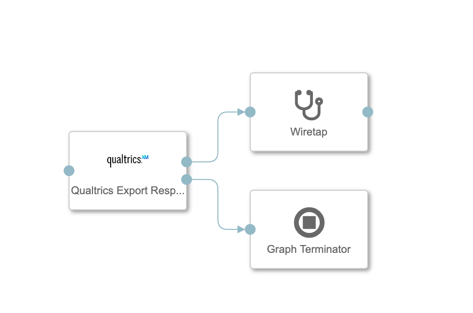
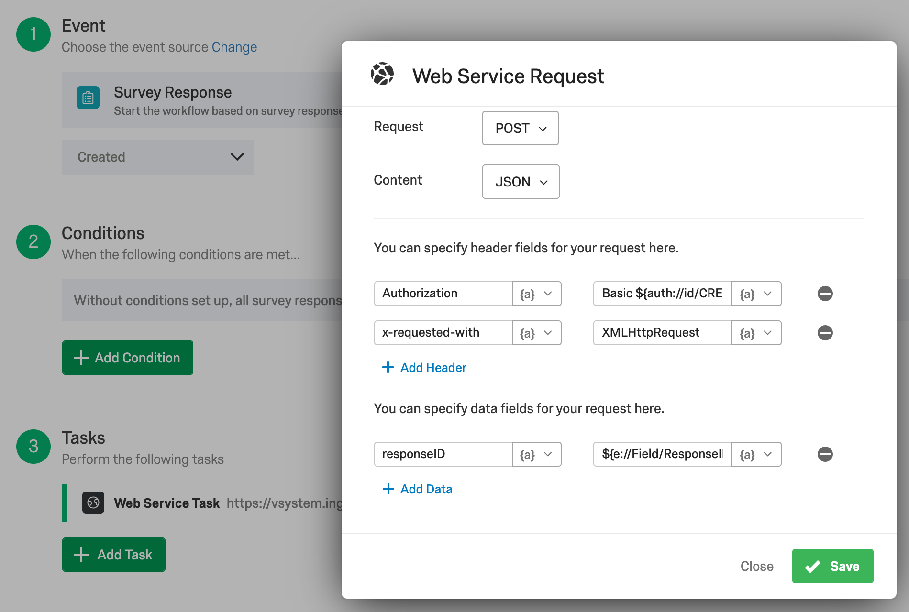

# Qualtrics Survey Operators #
The custom operators provided in this sample are designed to extract responses from **Qualtrics**.

Coding was done on Python 3.6.x and was tested with Data Hub version 2.7.

Author: Cassio Binkowski - [github](github.com/cassioiks) - [SAP profile](https://people.sap.com/cassio.binkowski)

## Requirements

Before you start using the example, please make sure that:

- You are familiar with the basic concepts of SAP Data Hub Modeling such Pipelines (Graphs), Operators and Dockerfiles.  For more information, you may refer to the Modeling Guide for SAP Data Hub that is available on the SAP Help Portal (https://help.sap.com/viewer/p/SAP_DATA_HUB).
- You are familiar with the basic concepts of Docker (https://docs.docker.com/get-started/) and Kubernetes (https://kubernetes.io/docs/concepts/overview/what-is-kubernetes/).

## Content
**1. Dockerfile 'qualtrics' ([Source code](src/qualtrics-1.0.0/content/files/vflow/dockerfiles/com/poc/qualtrics/qualtrics/Dockerfile))**

**2. Custom operator 'ExportResponses' ([Source code](src/qualtrics-1.0.0/content/files/vflow/subengines/com/sap/python36/operators/com/poc/qualtrics/exportResponses/operator.json))**
  - **continuous mode**: the operator will continuously fetch responses if `recurrence` is set to anything above 0. The first run will fetch all responses until present moment, and then only the delta
  - **single-run mode**: the operator will fetch all responses until present moment and terminate graph (`recurrence` set to 0)
  - derived from 'Python3Operator'
  - Uses image tag `qualtrics`
  - need to configure `API token`, `data center` and `survey ID` for operator to work. For more info on that, please consult [Qualtrics API info](https://api.qualtrics.com/docs/api-general-instructions)
  - **output port `responses` of Type string:** returns a batch of responses in CSV format
  - **output port `terminate` of Type string:** returns a signal to terminate graph (only used in single-run mode)

**3. Custom operator 'GetResponse' ([Source code](src/qualtrics-1.0.0/content/files/vflow/subengines/com/sap/python36/operators/com/poc/qualtrics/getResponse/operator.json))**
  - derived from 'Python3Operator'
  - Uses image tag `qualtrics`
  - need to configure `API token`, `data center` and `survey ID` for operator to work. For more info on that, please consult [Qualtrics API info](https://api.qualtrics.com/docs/api-general-instructions)
  - **input port `responseID` of Type string:** should be the body of an API call received from a Qualtrics action
  - **output port `response` of Type string:** returns the full Qualtrics survey response in CSV format

**4. Sample graphs**
  - **Extract Responses ([Source code](src/qualtrics-1.0.0/content/files/vflow/graphs/com/poc/qualtrics/ExtractResponses/graph.json))**: extract responses in batch mode, continuously or single-run
  
  - **Receive Response ([Source code](src/qualtrics-1.0.0/content/files/vflow/graphs/com/poc/qualtrics/receiveResponse/graph.json))**: start an API inside Data Hub to receive responses from Qualtrics as soon as they are finished. **NB:** You need to configure an `Action` inside Qualtrics survey to send the `response ID` via POST service call.
  

The API endpoint will be: https://`{Data Hub URL}`/app/pipeline-modeler/openapi/service/poc/qualtrics/survey

Configure Basic authentication with Data Hub user in this format:

- username: `{tenant}\{username}`
- pwd: `{user's password}`

  
## How to run
  - Import [solution/qualtrics-1.0.0.zip](solution/qualtrics-1.0.0.zip) via `SAP Data Hub System Management` -> `Files` -> `Import Solution`
  - Make sure you have your Qualtrics API information (API token, data center and Survey ID)
  - Open graphs `Extract Responses` and `Receive Response` and configure the respective Qualtrics operators with API information
  - Start the graphs and check the wiretaps for the outputs